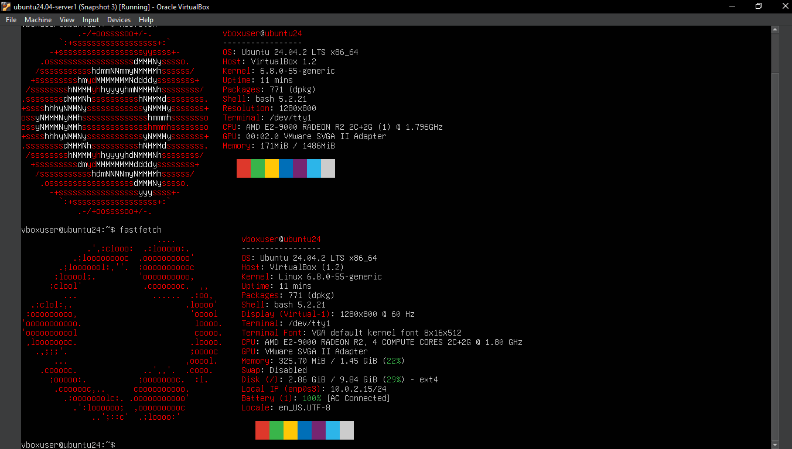

# uwc-hpc-team-2025

# UWC HPC Team 2025 🚀

Welcome to the official repository for the **University of the Western Cape High-Performance Computing Team (2025)**.

This repo contains setup instructions, evidence screenshots, and system configuration files as we prepare for national HPC competitions.

---

## 🔧 SSH Key Setup

To enable passwordless Git and remote logins, SSH keys were configured and tested.

📸 Screenshot:

---

## 🖥️ System Info

Our setup uses `fastfetch` and `neofetch` to show system specs.

📸 Screenshot:

---

## 👤 My Contributions

As part of the UWC HPC Team 2025, I contributed the following:

- ✅ Set up **SSH key authentication** for GitHub and remote servers  
- ✅ Used `fastfetch` and `neofetch` to capture system information  
- ✅ Managed Linux file operations and Git commits via terminal  
- ✅ Transferred screenshots from **Google Drive** and included them in the repo  
- ✅ Worked inside a **Linux VM on Windows**, navigating WSL file paths (`/mnt`)  
- ✅ Documented and committed evidence with clean filenames and structured repo layout

---

## 📂 Repo Contents

| File                             | Description                            |
|----------------------------------|----------------------------------------|
| `adding_ssh_key_to_git.png`      | SSH key setup screenshot               |
| `fastfetch+neofetch.PNG`         | System info via `fastfetch` & `neofetch` |
| `ssh_login_withoutkey_Sbonga.png`| Failed SSH login (no key)              |
| `ssh-key-login.png`              | Successful SSH login using key         |
| `README.md`                      | Project documentation                  |

---

## 🎯 Team Goals

- Learn and apply Linux + HPC tools  
- Automate secure access with SSH keys  
- Document reproducible environments  
- Compete in inter-university HPC challenges  
- Set up and potentially deploy clusters internationally  

---

## 🧠 Authors

- **Sbonga** — Team Member & Contributor  
- UWC HPC Team 2025

---

## 📜 License

MIT — free to reuse and adapt for learning or educational purposes.

